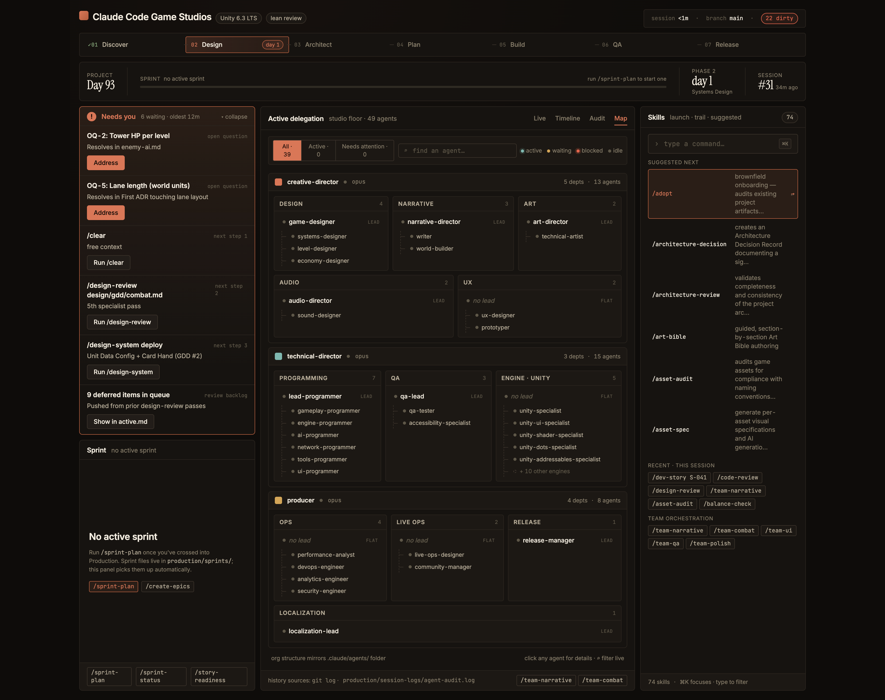

# CCGS Command Center

A local web dashboard for Claude Code projects. It scans your repo at
launch — agents in `.claude/agents/`, skills in `.claude/skills/`, git
history, current sprint, agent audit log — and surfaces it all in a
single Studio-Mode view at `http://localhost:5173`.

Read-only. It never modifies your repo.



> No screenshot yet — drop a PNG at `docs/screenshot.png` and it'll show up here.

## Quick start

Requires Node.js 20+.

```sh
git clone https://github.com/acoomes/ccgs-command-center.git
cd ccgs-command-center
./launch.sh                 # dev mode (HMR, auto-opens browser)
```

`launch.sh preview` builds and serves the production bundle instead. First
run installs npm deps (~30s); subsequent runs are instant.

Point it at your project by either copying the dashboard into your
project's `tools/` directory, or by editing the `REPO_ROOT` paths at the
top of each `scripts/extract-*.mjs` to point at the project you want to
inspect. (The default assumes the dashboard lives at
`<project>/tools/command-center/`.)

## What it shows

- **Header** — project name, engine, session age (time since last
  `## Session End:` marker), branch, dirty count
- **Phase pipeline** — 7-stage view, current phase highlighted from
  `production/stage.txt`
- **Project clock** — Day N (from first commit), current sprint, days
  in current phase, session #
- **Needs You** — open questions + next steps from
  `production/session-state/active.md`, plus blocked / in-review sprint
  stories
- **Sprint** — most-recent file in `production/sprints/`, parsed for
  goal + dates + stories grouped by Must / Should / Nice priority. If
  `production/sprint-status.yaml` exists, its status field overrides
  per story.
- **Active delegation** (centre column, four tabs)
  - **Live** — agents spawned in the current session (`SPAWN` events in
    `production/session-logs/agent-audit.log` newer than the most recent
    `## Session End:` marker, paired with `STOP`s; unpaired = live)
  - **Timeline** — last 14 commits with author + relative time
  - **Audit** — last 18 `SPAWN`/`STOP` entries with duration pairing
  - **Map** — full agent roster grouped by wing → dept → lead /
    specialist, engine-aware
- **Skills palette** (right column) — every skill in `.claude/skills/`,
  with ⌘K/Ctrl-K focus and ↑/↓/Enter navigation

If any source is missing (no sprint, no `active.md`, no audit log), the
matching panel shows an honest empty state instead of fake data.

## How it reads your repo

Five extractor scripts run before each dev/build, each writing a JSON
file consumed by a typed wrapper in `src/data/`:

| Script | Output | Source |
|---|---|---|
| `extract-agents.mjs` | `agents.generated.json` | `.claude/agents/*.md` frontmatter |
| `extract-project.mjs` | `project.generated.json` | `CLAUDE.md`, `production/` (incl. `sprints/`, `sprint-status.yaml`), `git`, engine `VERSION.md` |
| `extract-skills.mjs` | `skills.generated.json` | `.claude/skills/*/SKILL.md` frontmatter |
| `extract-history.mjs` | `history.generated.json` | `git log`, `agent-audit.log` |
| `extract-needs.mjs` | `needs.generated.json` | `production/session-state/active.md` |

Generated JSONs are gitignored. Re-running dev/build re-extracts.

## Live refresh

While the dev server runs, a Vite plugin
(`scripts/vite-live-refresh.mjs`) watches the extractor inputs and
re-runs the matching extractor when one changes:

| File / glob | Re-runs |
|---|---|
| `.claude/agents/*.md` | `extract-agents` |
| `.claude/skills/**/SKILL.md` | `extract-skills` |
| `CLAUDE.md`, `production/stage.txt`, `production/review-mode.txt`, `production/sprints/*.md`, `production/sprint-status.yaml`, `docs/engine-reference/**/VERSION.md` | `extract-project` |
| `production/session-logs/agent-audit.log` | `extract-history` |
| `production/session-state/active.md` | `extract-needs` |
| `.git/HEAD`, `.git/index` (branch checkout, stage, commit) | `extract-project` + `extract-history` |

Each extractor writes its `*.generated.json`, Vite HMR picks up the JSON
change, and the dashboard reloads — no manual restart needed.

## Sprint panel format

Sprint files at `production/sprints/*.md` are expected to follow the
shape produced by the `/sprint-plan` skill in
[Claude-Code-Game-Studios](https://github.com/Donchitos/Claude-Code-Game-Studios):

- Title line: `# Sprint N — START to END`
- `## Sprint Goal` followed by a one-line goal
- Three priority tables under `### Must Have`, `### Should Have`,
  `### Nice to Have` with columns including `ID`, `Task`,
  `Owner`/`Agent`, `Est. Days`

Story status is inferred from row keywords (DONE, IN PROGRESS, BLOCKED,
IN REVIEW, NOT STARTED). `production/sprint-status.yaml` can override
per story.

## Needs You panel sources

Merged into a single ranked list (highest first):

1. Blocked sprint stories (hot)
2. `## Open Questions` table in `active.md`
3. In-review sprint stories
4. `## Next Steps` numbered list in `active.md` (top 3; embedded
   `` `/skill args` `` becomes a runnable action)
5. `## Deferred Recommended Items` rollup count

## Origin

Extracted from
[Donchitos/Claude-Code-Game-Studios](https://github.com/Donchitos/Claude-Code-Game-Studios),
where it lives at `tools/command-center/` and is launched via a
`/command-center` Claude Code skill. The standalone repo here is for
anyone who wants the dashboard without the rest of CCGS.

## License

MIT — see [LICENSE](LICENSE).
